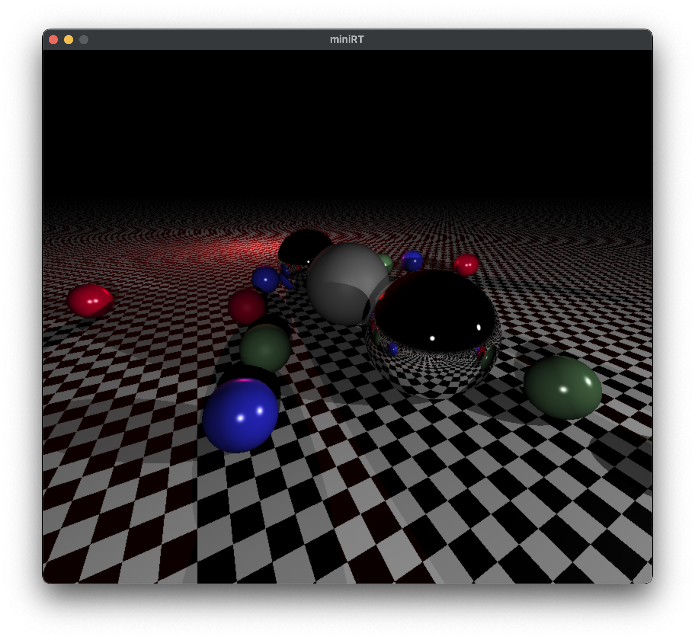

# miniRT
Minimal implementation of raytracing using C and mlx for window management  



## Usage
```
./miniRT [scene file .rt]
```

## Run
```
git clone git@github.com:greg-gav/miniRT-release.git
cd miniRT-release && make 
./miniRT scenes/sphere.rt
```