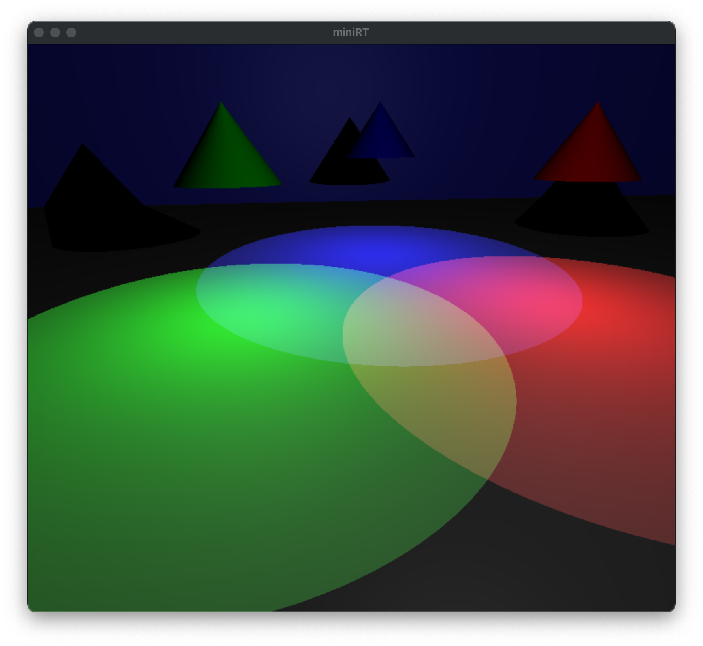
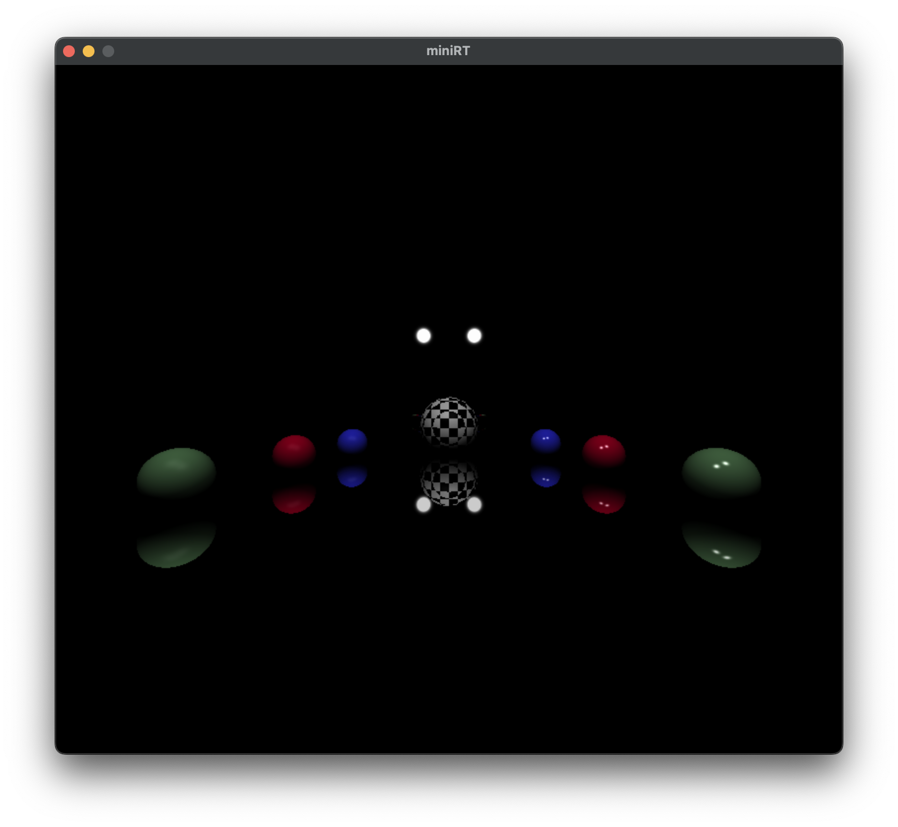
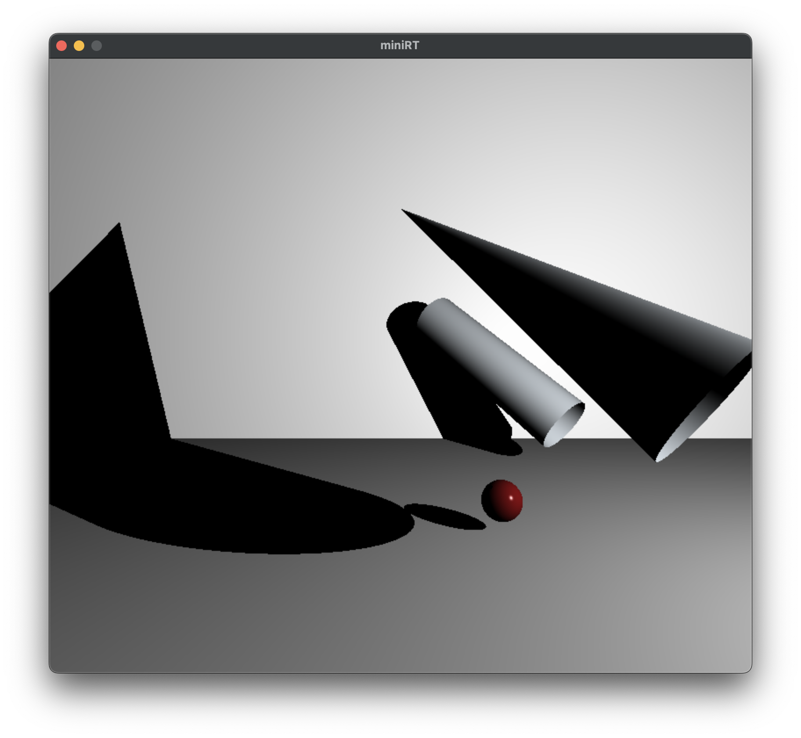
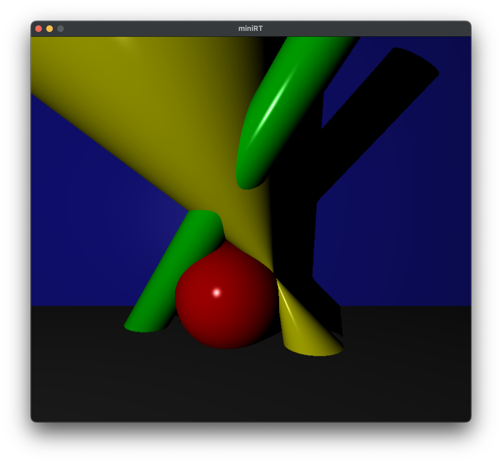
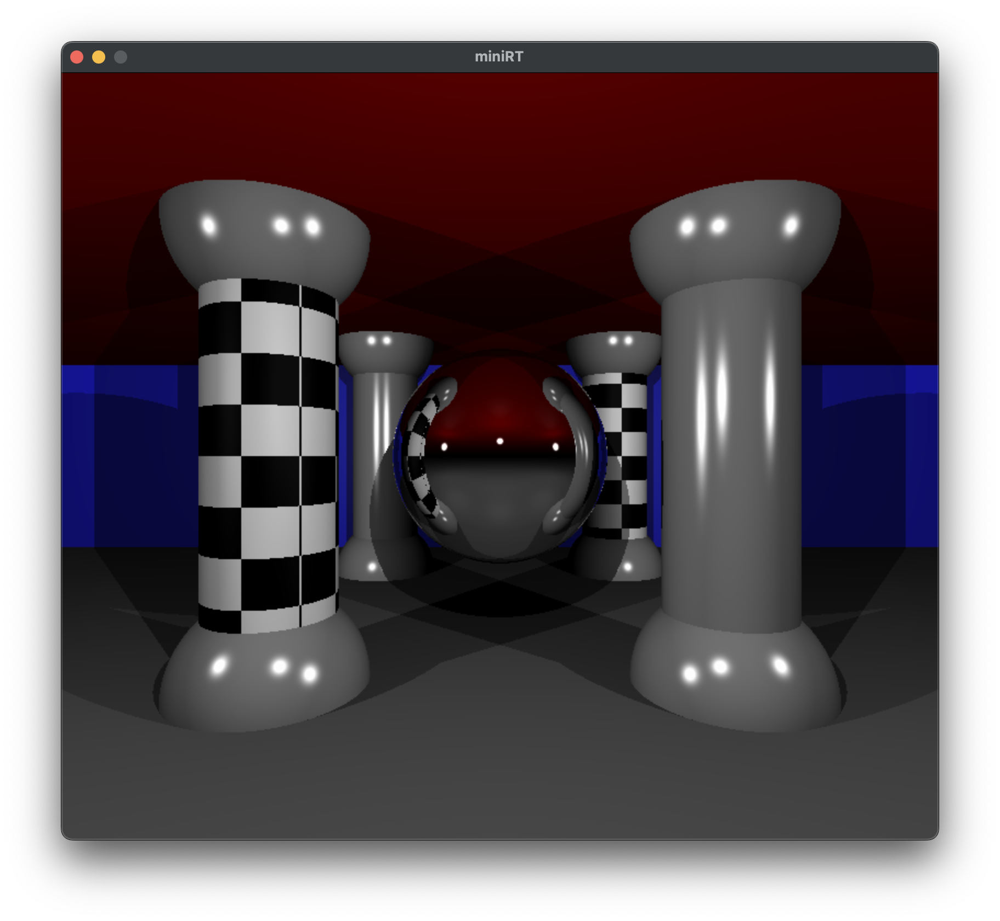
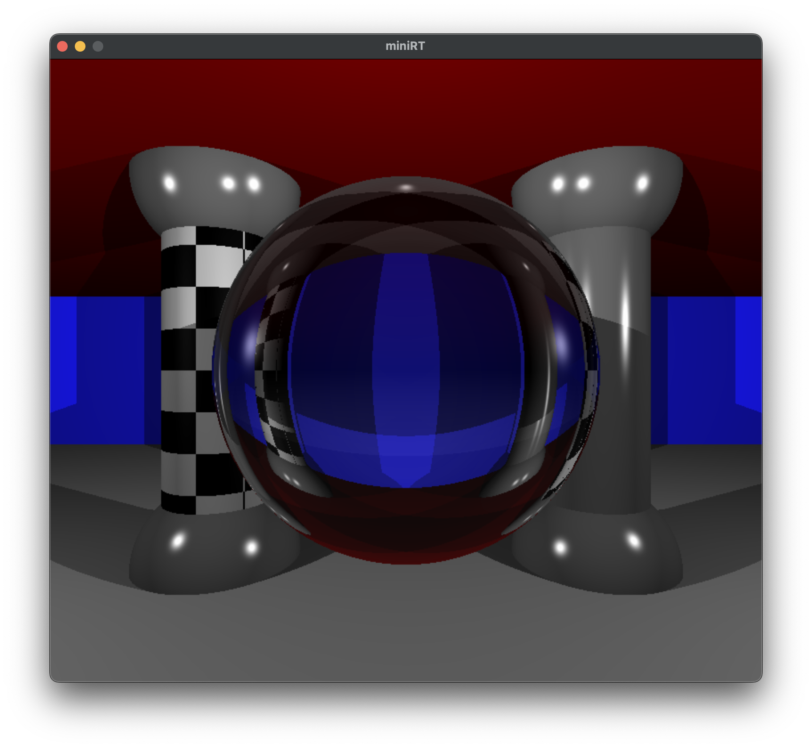
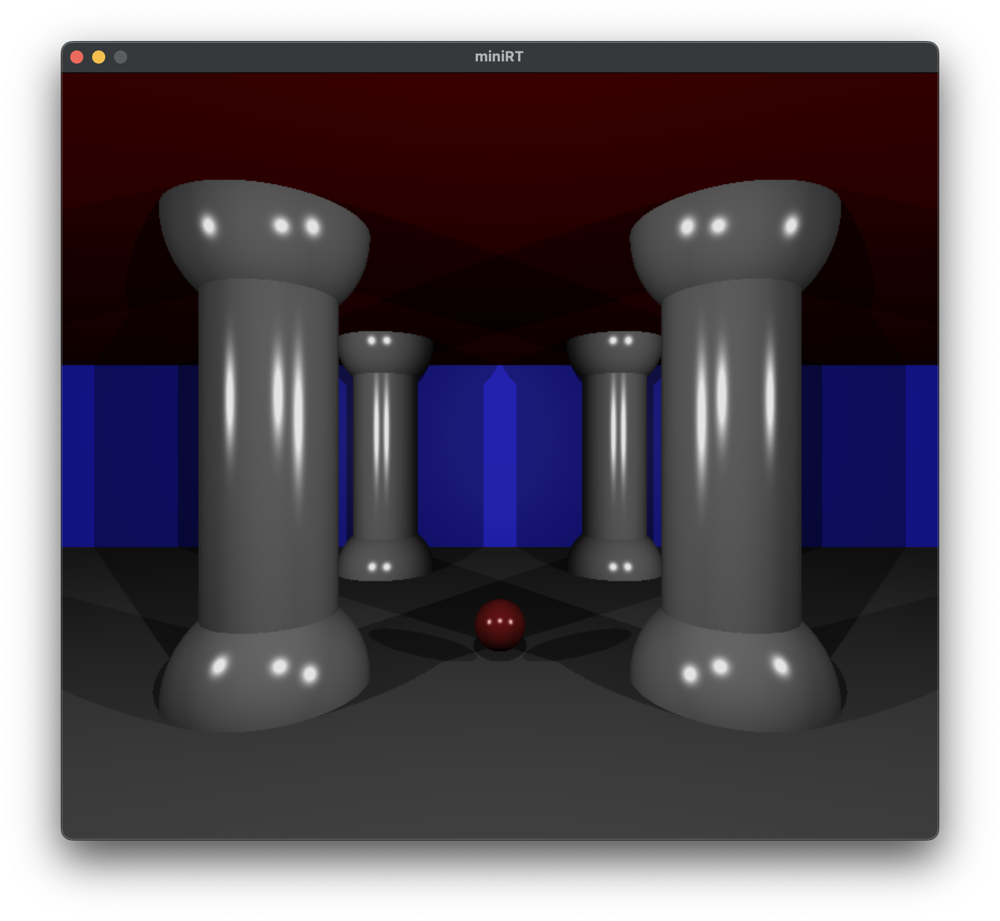

# miniRT
Minimal implementation of raytracing using C and mlx for window management  


## Usage
```
./miniRT [scene file .rt]
```

## Run
```
git clone git@github.com:greg-gav/miniRT-release.git
cd miniRT-release && make 
./miniRT scenes/sphere.rt
```

## Information
Some scene files provided for reference in scenes/ directory  

## More Examples

### Mixing colors 


### Sample materials 


### Hard shadows 


### Basic shapes 


### Some reflections 


### Some transparency 


### Columns scene 

